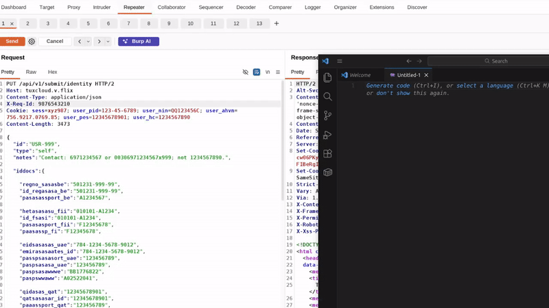

# 🛡️ Burp Request / Response Anonymizer

**License:** [GPL‑3.0‑only](LICENSE)  
**Author:** [Dimitris Vagiakakos](https://www.tuxhouse.eu) · [@sv1sjp](https://github.com/sv1sjp)

**Latest Version:** 1.0.3


A Burp Suite extension that redacts PII, credentials, and other sensitive data from HTTP traffic with one click, enabling secure sharing of requests and responses in reports, team reviews, or AI workflows.



---

## Use Case Matrix

| Scenario | Risk | Mitigation |
|-----------|------|-------------|
| **Pentest or audit reporting** | Inclusion of client PII in shared logs | Automated anonymization before publishing |
| **Cross‑team debugging** | Exposure of internal API keys, hosts or data | Redacts credentials while retaining structure |
| **Machine learning & LLM workflows** | Data privacy concerns in model input | Secure pre‑processing layer before sharing |
| **Demonstrations & training** | Display of real client payloads | Generates realistic yet anonymized examples |

---

## Design Principles
Pattern detection over just variable names.

| Principle | Description |
|------------|-------------|
| **Pattern‑first detection** | Identifies sensitive data based on value shape rather than key names, such as Credit Cards (VISA, MasterCard), Identity Cards and Passports  (US, EU, UAE, India, Turkey etc.)
| **Consistent placeholders** | Maintains structural validity while ensuring referential anonymity. |
| **Idempotent redaction** | Skips already‑redacted tokens to prevent overwriting. |
| **Context‑aware scanning** | Evaluates surrounding content for hidden or embedded identifiers. |
| **Fuzzy key recognition** | Matches irregular keys (e.g., `pasp_sg`, `custnr`, `emir_id`) using partial token logic. |

---

## Detected Data Patterns

This table details the categories of sensitive data the extension detects and redacts across HTTP traffic: 

| Category | Redacted Elements | Highlights |
|-----------|------------------|-------------|
| **Identity & Authentication** | Emails, Passports, Health IDs, Identity Cards, UUIDs, JWTs, tokens, passwords | Detects structured and embedded values |
| **Network & Session** | Domains, IPs, URLs, cookies, headers (`Authorization`, `X‑API‑Key`) | Retains logical and syntactic integrity |
| **Financial** | PAN, IBAN, VISA, Mastercard SWIFT/BIC, CVV | Validated through format- and checksum‑based matching |
| **Location & Contact** | Phone numbers, GPS coordinates, postal addresses | Context‑aware geographic detection |
| **Unstructured Fields** | `notes`, `comments`, `description`, `body` | Entire field redacted at key level |
| **Encodings & Payloads** | JSON, XML, Base64, multipart/form‑data | Applies decoding and final anonymization passes |

The extension scans for these patterns across headers, bodies, query parameters, and encoded payloads using regex, checksum validation, and contextual analysis. It prioritizes format accuracy over key names to detect sensitive data in custom or obfuscated fields. Redacted values use type-specific placeholders that maintain parseability for downstream tools.

---

## Installation

Option 1: Build the JAR from source
   ```bash
   ./build.sh     # Requires JDK 11+
   ```
Option 2: Use the prebuilt JAR
* In both cases, install the JAR into Burp Suite:
   * Open Extensions → Installed → Add
   * Select the JAR file
  
 ##  BApp Store? -> Soon :)
----
## Report Issues - Help improve redaction accuracy
If you notice unredacted sensitive data or encounter bugs:
- Open an issue on [GitHub Issues](https://github.com/sv1sjp/BurpAnonymizer/issues)

Including anonymized snippets helps refine detection patterns and improve privacy coverage across diverse data structures.
